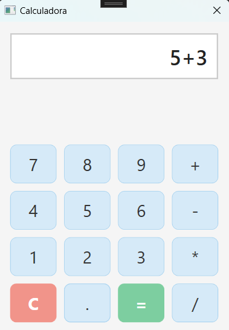
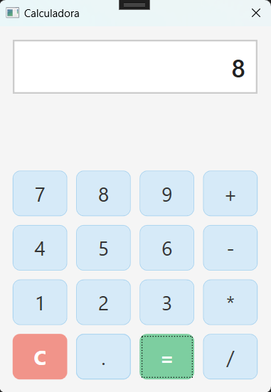
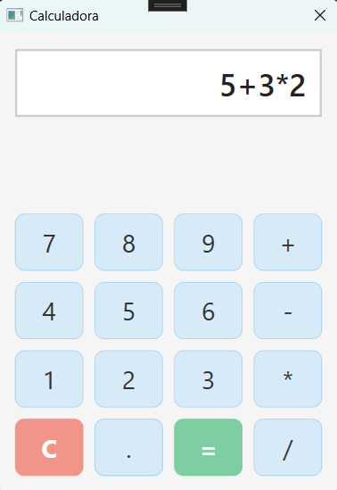
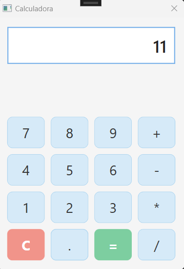
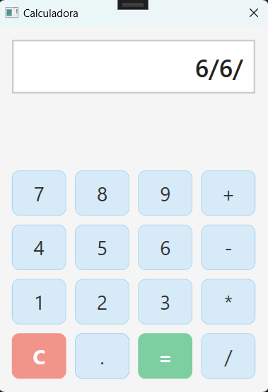
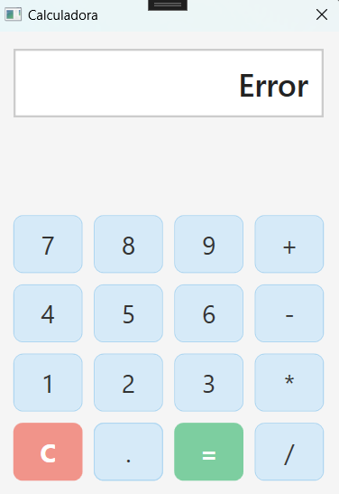

# <i class="fa-solid fa-calculator"></i> Calculadora WPF

Una calculadora bàsica desenvolupada amb **Windows Presentation Foundation (WPF)** per al mòdul _M0488 - Desenvolupament d’Interfícies_.

---

## <i class="fas fa-bookmark"></i> Taula de continguts
- [ Calculadora WPF](#-calculadora-wpf)
  - [ Taula de continguts](#-taula-de-continguts)
  - [ Requisits](#-requisits)
  - [ Guia d’instal·lació](#-guia-dinstallació)
  - [ Característiques](#-característiques)
  - [ Prioritat d’operadors](#-prioritat-doperadors)
    - [ Operacions bàsiques](#-operacions-bàsiques)
    - [ Funcionalitats addicionals](#-funcionalitats-addicionals)
  - [ Ús](#-ús)
  - [ Exemples](#-exemples)
    - [Operació sumatòria](#operació-sumatòria)
    - [Operació encadenada](#operació-encadenada)
    - [Operació amb error](#operació-amb-error)
  - [ Context acadèmic](#-context-acadèmic)
  - [ Llicència](#-llicència)
  - [Conclusions i reflexions sobre el projecte](#conclusions-i-reflexions-sobre-el-projecte)

---

## <i class="fa-solid fa-plug"></i> Requisits

- <i class="fab fa-windows"></i> **Windows 10/11**
- <i class="fas fa-code"></i> **.NET 8.0 Runtime**
- <i class="fas fa-laptop-code"></i> **Visual Studio 2022** (per al desenvolupament)

---

## <i class="fa-solid fa-rocket"></i> Guia d’instal·lació

1. **Clona el repositori:**

   ```bash
   git clone https://github.com/your-username/WpfCalculator.git

2. **Obre el projecte a Visual Studio:**

    2.1. _Ves a la carpeta clonada._

    2.2. _Obre el fitxer Calculator.sln amb Visual Studio 2022._

3. **Compila la solució:**

    3.1. _A Visual Studio, ves a Build ➔ Build Solution (o prem Ctrl+Shift+B)._

4. **Executa l’aplicació:**

    4.1. _Prem el botó verd de Start o prem F5 per executar el projecte._

---

## <i class="fa-solid fa-list-check"></i> Característiques

## <i class="fa-solid fa-scale-balanced"></i> Prioritat d’operadors
- Avalua `*` i `/` abans de `+` i `-`  
  _Exemple: `5 + 3 * 2 = 11`_

### <i class="fa-solid fa-plus"></i> Operacions bàsiques
- <i class="fas fa-plus"></i> **Suma**
- <i class="fas fa-minus"></i> **Resta**
- <i class="fas fa-times"></i> **Multiplicació**
- <i class="fas fa-divide"></i> **Divisió**

### <i class="fas fa-star"></i> Funcionalitats addicionals
- <i class="fas fa-undo"></i> **Neteja** (`C`)
- <i class="fas fa-exclamation-triangle"></i> **Gestió d’errors**
- <i class="fas fa-link"></i> **Operacions encadenades**

---

## <i class="fas fa-book-open"></i> Ús

1. **Operacions bàsiques**:  
   Fes clic als botons numèrics (0–9), selecciona l’operador (+, -, *, /) i prem `=` per veure el resultat.

2. **Reinici de càlcul**:  
   Prem `C` per netejar la pantalla.

3. **Operacions encadenades**:  
   Exemple: `5 + 3 * 2` s’avalua correctament seguint la prioritat.

4. **Gestió d’errors**:  
   Entrades incorrectes mostren `Error` a la pantalla.

---

## <i class="fas fa-images"></i> Exemples

### Operació sumatòria  
**Exemple: 5 + 3 = 8**  
<p>
  
  
</p>

---

### Operació encadenada  
**Exemple: 5 + 3 × 2 = 11**  
<p>
  
  
</p>

---

### Operació amb error  
**Exemple: 6 / 6 / → Error**  
<p>
  
  
</p>

---

## <i class="fa-solid fa-graduation-cap"></i> Context acadèmic

Aquest projecte es va desenvolupar per posar en pràctica:

- <i class="fas fa-laptop-code"></i> Maquetació amb **WPF/XAML**
- <i class="fas fa-project-diagram"></i> Arquitectura d’esdeveniments
- <i class="fas fa-palette"></i> Principis de **UI/UX**
- <i class="fas fa-cogs"></i> Lògica funcional d’una calculadora

---

## <i class="fas fa-balance-scale"></i> Llicència

- **MIT License**  
- **Autora**: Montse Orozco

---

## Conclusions i reflexions sobre el projecte

Aquest projecte és una demostració pràctica del patró MVVM en una aplicació WPF. Els aspectes més importants són:

* **Separació de responsabilitats:**  
  MVVM facilita la gestió, proves i depuració del codi en aïllar la interfície d’usuari de la lògica. La Vista és “passiva”, el ViewModel gestiona l’estat i les interaccions, i el Model realitza la lògica principal.

* **Enllaç de dades:**  
  El potent sistema d’enllaç de dades de WPF actua com a element connector entre la Vista i el ViewModel, reduint la necessitat de manipular la interfície des del codi.

Finalment, aquesta implementació serveix com a base per a futures ampliacions, com ara afegir funcionalitats de memòria, suport per operacions avançades o la possibilitat de canviar entre diferents temes visuals, augmentant així la versatilitat i la potència de l’aplicació.

---

<link rel="stylesheet" href="https://cdnjs.cloudflare.com/ajax/libs/font-awesome/6.4.0/css/all.min.css">